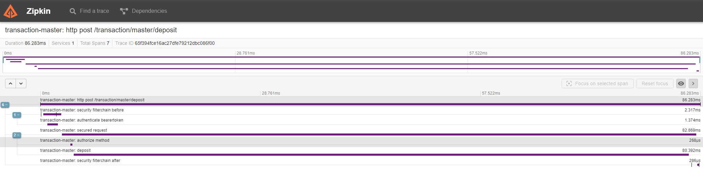

# Transaction Master Application

Welcome to the Transaction Master Application! This application serves as a powerful tool for managing transactions efficiently.

## Table of Contents

1. [Introduction](#introduction)
2. [Features](#features)
3. [Dependencies](#dependencies)
4. [Getting Started](#getting-started)
5. [Usage](#usage)
6. [Pre Configured Users](#pre-configured-users)
7. [Configuring Your Own User](#configuring-your-own-user)
8. [License](#license)

## Introduction

The Transaction Master Application is designed to simplify the process of managing transactions. It provides a user-friendly API for performing various transaction-related tasks, including deposit, transfer, and viewing transactions.

## Features

- **Transaction Management**: Easily create and view transactions.
- **Role-Based Access Control**: Securely manage access to transaction-related features based on user roles.
- **Reporting**: Generate comprehensive transaction reports for analysis and auditing purposes.
- **Integration with Keycloak**: Seamlessly integrate with Keycloak for robust authentication and authorization.

## Dependencies

Please ensure the following are on your classpath before getting started.

- **Maven**
- **Docker**

## Getting Started

To get started with the Transaction Master Application, follow these steps:

1. **Clone the Repository**: Clone the application repository to your local machine.
   ```bash
   git clone https://github.com/Gidz109/transaction-master.git
   
2. **Install Dependencies**: Navigate to the project directory and install the dependencies.
   ```bash
   cd transaction-master
   mvn clean install

3. **Configure Local Environment**: Set up the required environment for database connection, Keycloak integration, Zipkin Observability, etc.

    ```bash
   cd local-environment
   ./first_run_environment.sh or ./first_run_environment.bat

4. **Run the Application**: Start the application locally with **dev** profile.
   ```bash
   mvn spring-boot:run -Dspring-boot.run.profiles=dev

5. **Access the Application Documentation**: Open your web browser and navigate to http://localhost:8081/swagger-ui/index.html to access the API Definition.

## Usage
Once the application is up and running, you can perform the following actions:   

There is a **postman collection** included in this project for ease of use under the local-environment directory.

- **Login**: Use your credentials to log in to the application.
- **Deposit Funds**:Deposit funds into your account by providing the necessary details.
- **Transfer Funds**: Transfer funds from your account to another account.
- **Generate Reports**: Generate a transaction reports based on your past transactions. - Generated reports can be found under **target/generated-sources/transactionSummary.pdf**

## Pre Configured Users

The application comes standard with two users - 

- John Doe
  - Roles - ['**deposit**', '**transfer**']
  - Username - johndoe
  - Password - passworrd
- Jane Doe
  - Roles ['**report**', '**deposit**']
  - Username - janedoe
  - Password - passworrd

## Configuring Your Own User

When the environment is running, navigate to http://localhost:8080/ to access the **Keycloak admin console** with user admin and password admin.

From there you can modify the custom payments realm that was imported as part of the initial environment setup script located in **./local-environment/auth/config.realm.json**

You would also need to add a flyway migration script under ./src/main/resources/db/migration/dev to insert your user and to allow the application to tie the JWT token to the requesting user using the **"preferred_username"** claim.

### Sample Script

   ```
   insert into transactionmaster.tmsch."user"(name, surname) values ('John', 'Doe');
   insert into transactionmaster.tmsch.authentication(username, retry_count, locked, user_id) values ('johndoe', 0, false, 1);
   ```

## Observability

The application endpoints are observed by micrometer and recorded in Zipkin, to access all request details, 
go to http://localhost:9411/zipkin/ and select "Run Query" at the top right of the Zipkin admin console.

From there any request will be detailed as per below screenshot - 



## License
This project is licensed under the MIT License.
